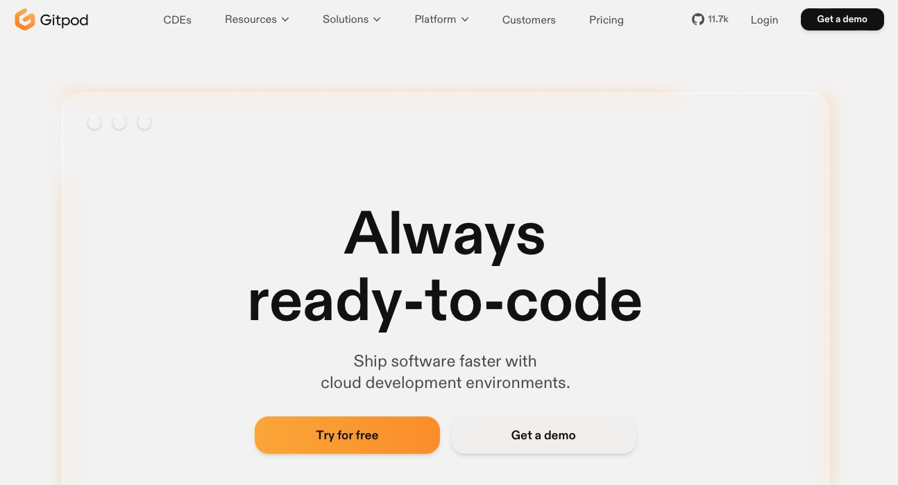
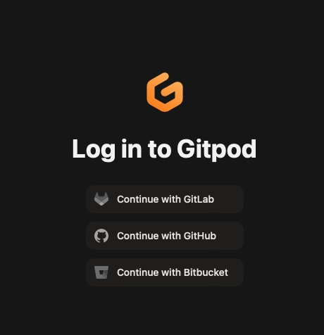
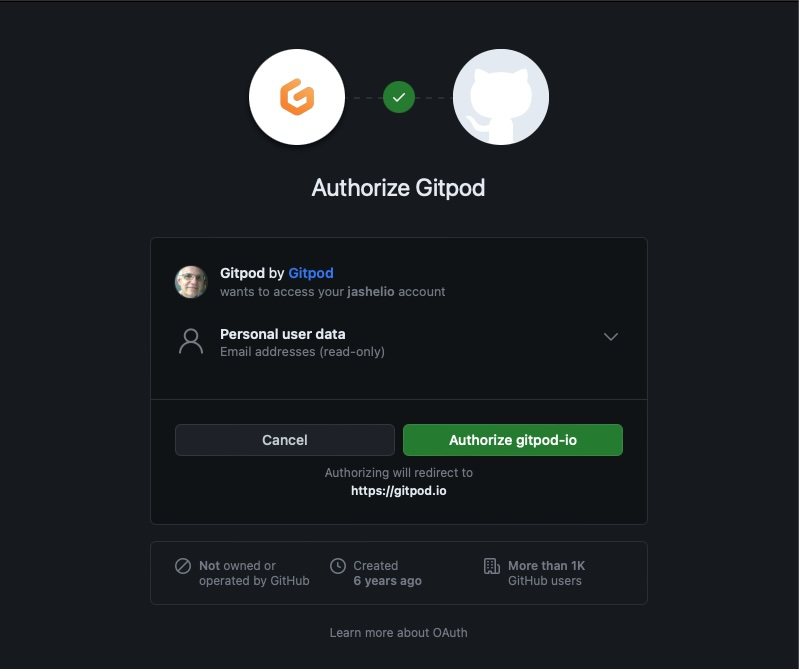
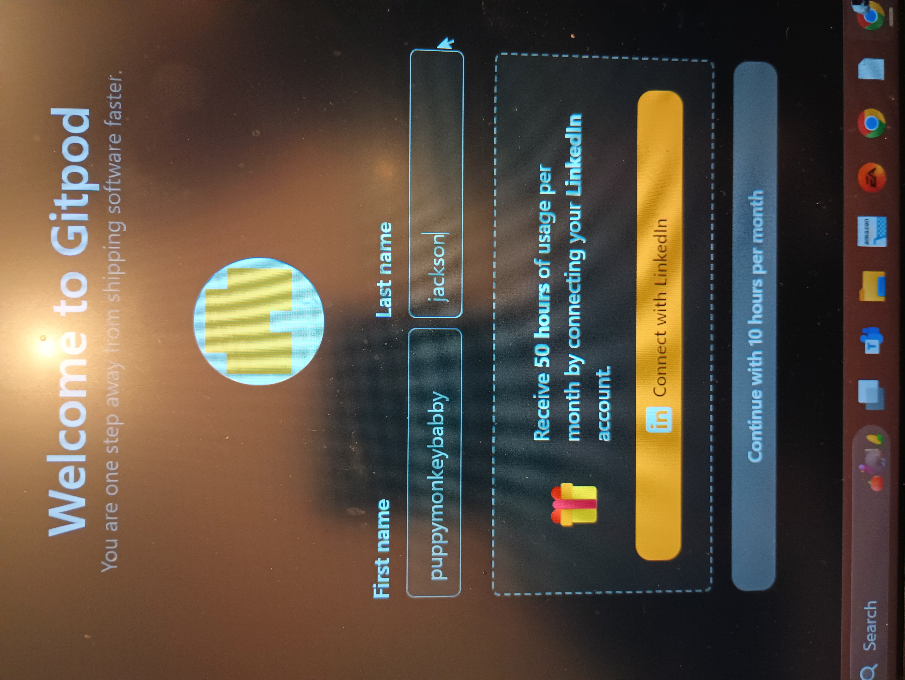
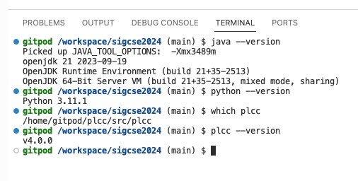
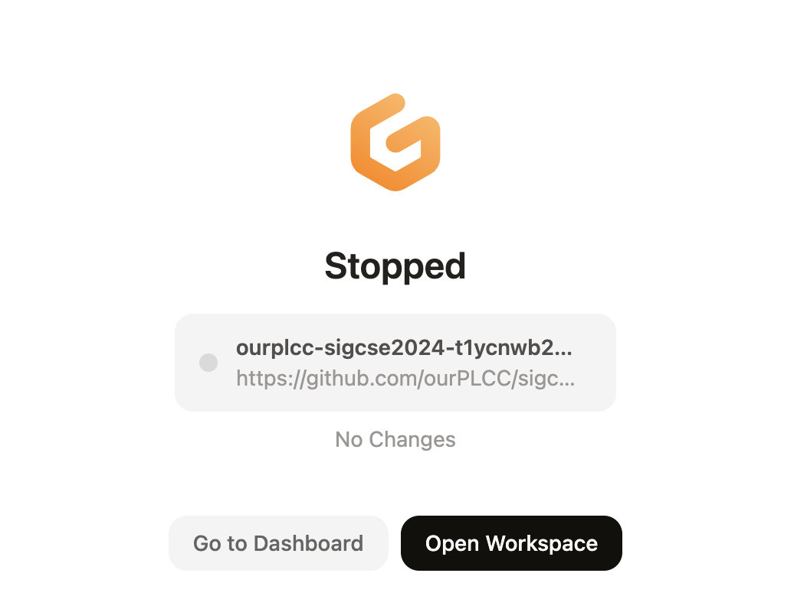

# Pre Workshop Setup

Please do your best to complete these instructions before attending
the workshop.

## Expected time

15-30 minutes

## Overview

During the workshop, you will work in small teams to complete some activities.
At least one of your team members needs to have completed the instructions
in this document. To ensure we have a critical mass of participants that
have completed these instructions, please try to complete them now. If
you cannot, no worries, I'm sure others will and you can share on with them.

You will need free accounts on GitHub and GitPot. No prior experience with
these services and Git are necessary to participate in this workshop.
The instructions on this page will walk you through creating the
necessary accounts and testing that you have access
to the workshop materials.

## GitHub

The materials for this workshop are stored in a Git repository on GitHub.
You will need a free GitHub account so that you fork (make a copy) of this
repository so you can save your progress through its activities.

If you don't have a GitHub account, please create one now.

* <https://github.com/>

Now that you have an account on one of these services continue on.

## GitPod and LinkedIn

GitPod provides ephemeral workspaces (virtual machines on a remote server)
for software development. We'll use it to provide you with a development environment,
pre-installed with PLCC and the workshop materials.

GitPod provides its users with 10 free computing
hours per month of workspace runtime, 50 free hours per month if you
associate your LinkedIn account with it.
So, if you want the 50 free hours per month, please create a LinkedIn
account first.

* [LinkedIn](https://linkedin.com/)

Now that you have a LinkedIn account and a GitHub account, let's get back
to GitPod. Below are detailed instructions for creating a GitPod account.

## Create a GitPod Account

1. Navigate to <https://gitpod.io/>. GitPod should greet you with something
like this.



2. Click "Try for free" and it'll provide you a choice of ways to create
an account.



3. Select the service with whom you have an account. GitPod will send you to that service to request authorization to read and write repositories in that service with your authority.



4. Authorize GitPod to act on your behalf in the service and you will
be redirected back to GitPod for configuration.



5. If you have a LinkedIn account, nows the time to
connect it to GitPod to get 50 free hours per month. Otherwise, you can continue with 10 free hours per
month.


6. Use the default configuration for editor. In particular, please
select "VS Code, Browser" for your editor. You can change this after
the workshop if you prefer.

    Next you'll be asked some survey questions. Answer them how you like.


7. When you continue you will be taken to your GitPod Dashboard.


8. Now let's confirm that you can start your personal workspace that
contains the workshop materials and PLCC pre-installed.

    Click "New Workspace"


9. In "Select a repository" paste: https://github.com/ourPLCC/sigcse2024
    and select "Continue".

    After a few seconds you will see a VS Code editor. In the lower right
    you will be asked if you want to open the workspace in VS Code
    Desktop?


10. Please close this by pressing the X in the dialog's upper-right corner. Please DO NOT press open.


11. Now try the following commands in the terminal in the bottom pane:

    ```bash
    java --version
    python --version
    plcc --version
    ```

    You should see something similar to the following, which means everything
    is working.



12. You can now stop your workspace by pressing CTRL+SHIFT+P (CMD+SHIFT+P on Mac), search for and select "GitPod: Stop Workspace".


13. Once you see something like the following you can close the tab.



## Congratulations!

That's it! You are ready for the workshop!

While you wait for the workshop, feel free to take a look at some of the
many languages that have been implemented using PLCC:
<https://github.com/ourPLCC/languages>.

## Help!

If you have any problems with the above, please contact Stoney Jackson <dr.stoney@gmail.com>.
